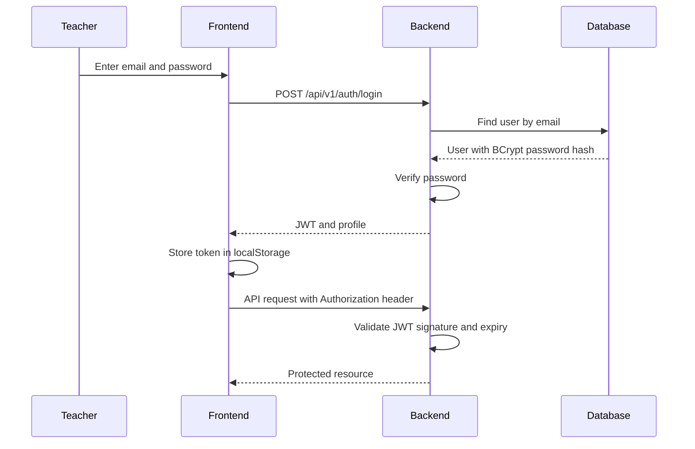

# Authentication Flow

## Roles

- `TEACHER`: full access in MVP.
- `PARENT`: reserved for future portal.
- `STUDENT`: reserved for future portal.

## Security Checklist

- Use HTTPS in production.
- Rotate `JWT_SECRET` through a secret manager.
- Keep JWT expiry reasonably short.
- Use refresh tokens only if persistent sessions are needed.
- Add account lockout and password reset before public launch.
