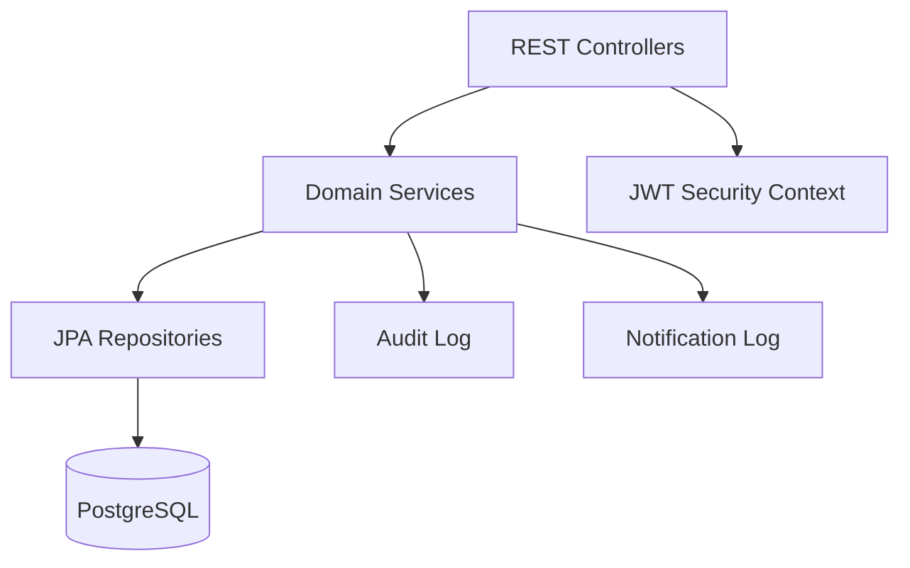

# Backend Architecture

## Layers

## Modules

- `auth`: JWT creation and request authentication.
- `config`: Spring Security, seed data, application bootstrap configuration.
- `domain`: JPA entities and enums.
- `repository`: Spring Data repositories.
- `service`: dashboard aggregation, file storage, audit helpers.
- `web`: REST controllers.

## Security

All `/api/v1/**` endpoints require a valid Teacher/Admin JWT except `/api/v1/auth/login`. Passwords use BCrypt. The current MVP authorizes only `ROLE_TEACHER` for application APIs, while the role model supports future Parent and Student portals.

## Production Notes

- Replace `ddl-auto=update` with migrations.
- Use a long external `JWT_SECRET`.
- Move receipt storage from local volume to object storage for cloud deployments.
- Add real WhatsApp/SMS/Email providers behind the notification log.
