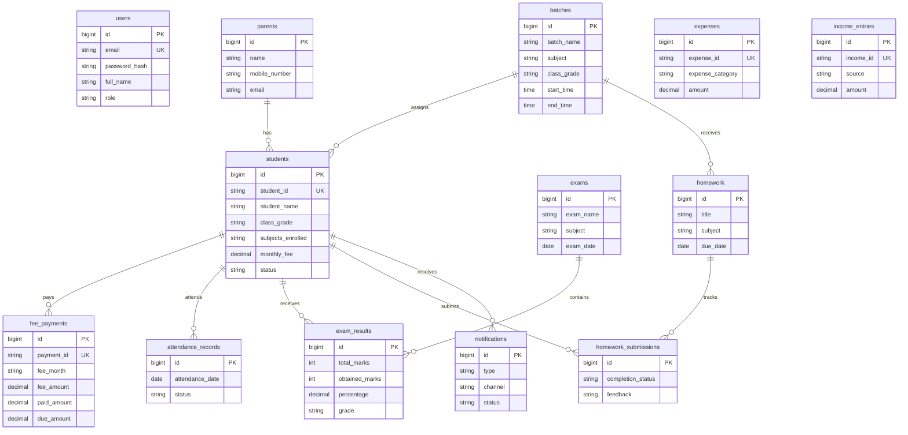

# ER Diagram

```mermaid
erDiagram
  users {
    bigint id PK
    string email UK
    string password_hash
    string full_name
    string role
  }
  parents ||--o{ students : has
  batches ||--o{ students : assigns
  students ||--o{ fee_payments : pays
  students ||--o{ attendance_records : attends
  students ||--o{ exam_results : receives
  exams ||--o{ exam_results : contains
  batches ||--o{ homework : receives
  homework ||--o{ homework_submissions : tracks
  students ||--o{ homework_submissions : submits
  students ||--o{ notifications : receives

  parents {
    bigint id PK
    string name
    string mobile_number
    string email
  }
  students {
    bigint id PK
    string student_id UK
    string student_name
    string class_grade
    string subjects_enrolled
    decimal monthly_fee
    string status
  }
  batches {
    bigint id PK
    string batch_name
    string subject
    string class_grade
    time start_time
    time end_time
  }
  fee_payments {
    bigint id PK
    string payment_id UK
    string fee_month
    decimal fee_amount
    decimal paid_amount
    decimal due_amount
  }
  attendance_records {
    bigint id PK
    date attendance_date
    string status
  }
  exams {
    bigint id PK
    string exam_name
    string subject
    date exam_date
  }
  exam_results {
    bigint id PK
    int total_marks
    int obtained_marks
    decimal percentage
    string grade
  }
  homework {
    bigint id PK
    string title
    string subject
    date due_date
  }
  homework_submissions {
    bigint id PK
    string completion_status
    string feedback
  }
  expenses {
    bigint id PK
    string expense_id UK
    string expense_category
    decimal amount
  }
  income_entries {
    bigint id PK
    string income_id UK
    string source
    decimal amount
  }
  notifications {
    bigint id PK
    string type
    string channel
    string status
  }
```
