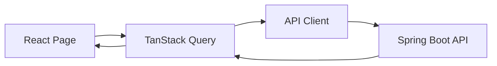

# Frontend Architecture

## Structure

- `src/api`: API client, shared API types, JWT token storage.
- `src/components`: reusable app shell, page header, stat cards.
- `src/pages`: dashboard and module pages.
- `src/theme`: Material UI theme.

## UI Principles

- Mobile-first navigation with a temporary drawer on phones and permanent sidebar on desktop.
- Tables for operational data and cards for summary metrics.
- Teacher-first workflows: quick login, dashboard overview, then module-specific pages.
- Material UI components keep forms, dialogs, cards, chips, and tables consistent.

## Data Flow

