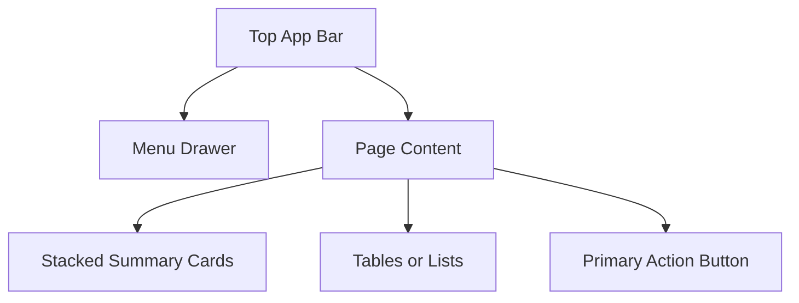
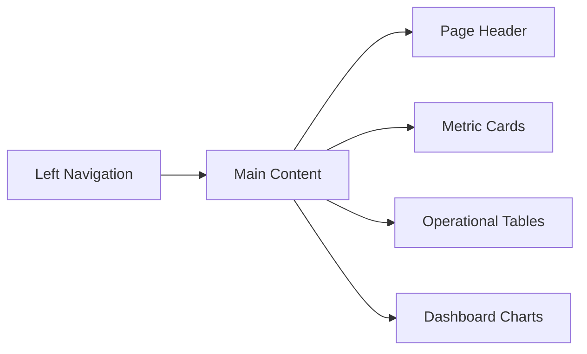

# UI Wireframes

## Mobile Layout

## Desktop Layout

## Main Screens

- Dashboard: total students, active students, classes today, monthly income, monthly expenses, net profit, pending fees, attendance summary, upcoming exams, recent payments.
- Students: searchable table, add/edit form, parent details, class, subjects, batch, fee, active/inactive status.
- Fees: payment history, dues, partial payments, payment mode, receipt-ready data.
- Attendance: daily records and absence status.
- Exams: scheduled tests and results entry path.
- Homework: assignment list and completion tracking path.
- Expenses and Income: monthly finance entry and review.
- Reports: export cards for CSV downloads.
- Notifications: queued parent communication log.
